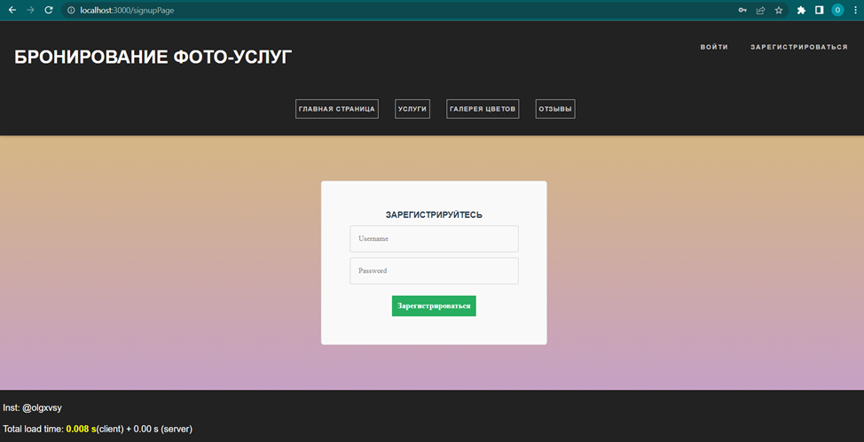
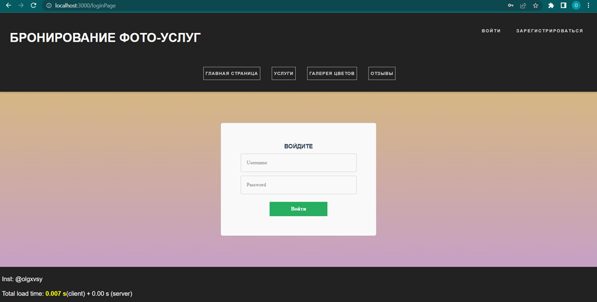
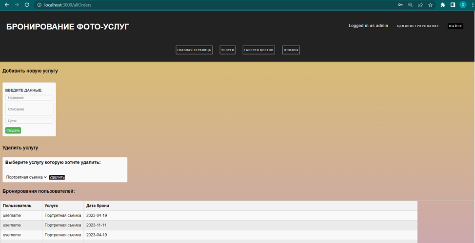
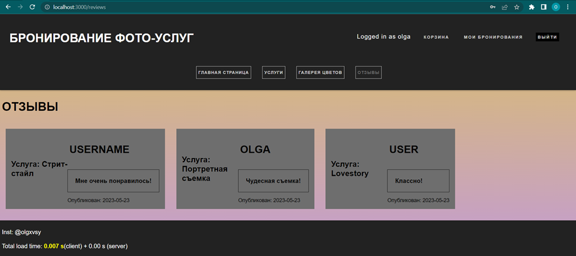
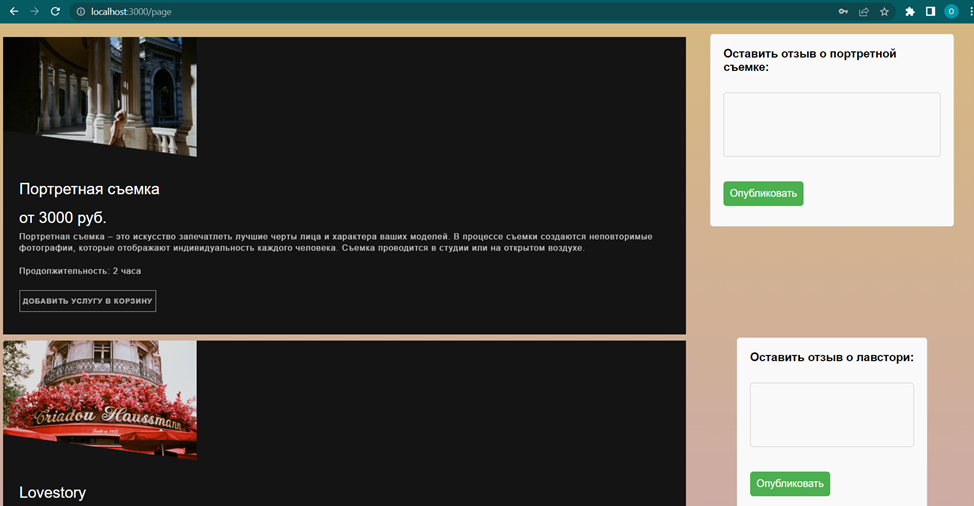
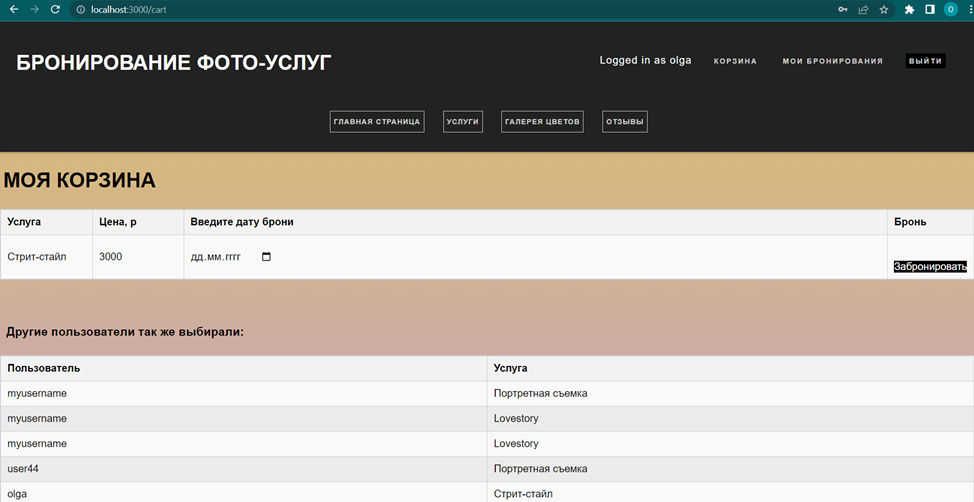
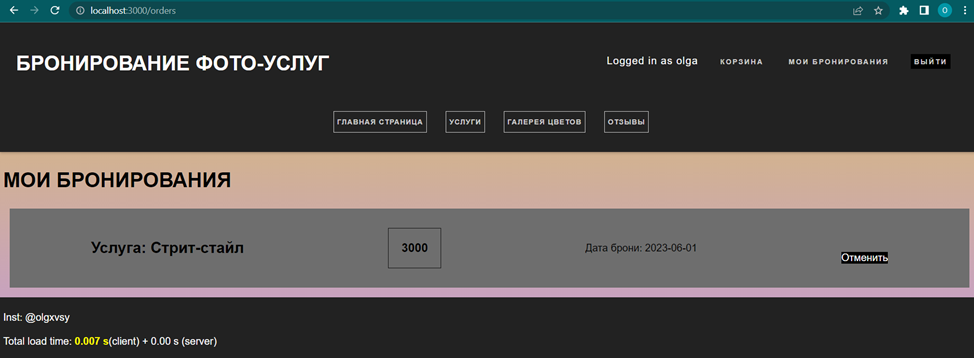
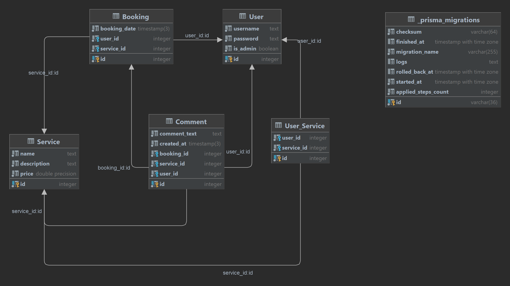
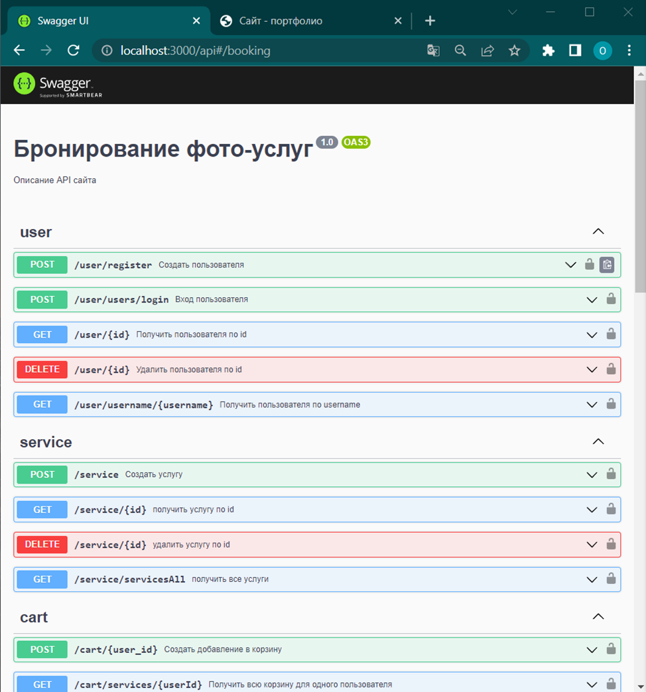
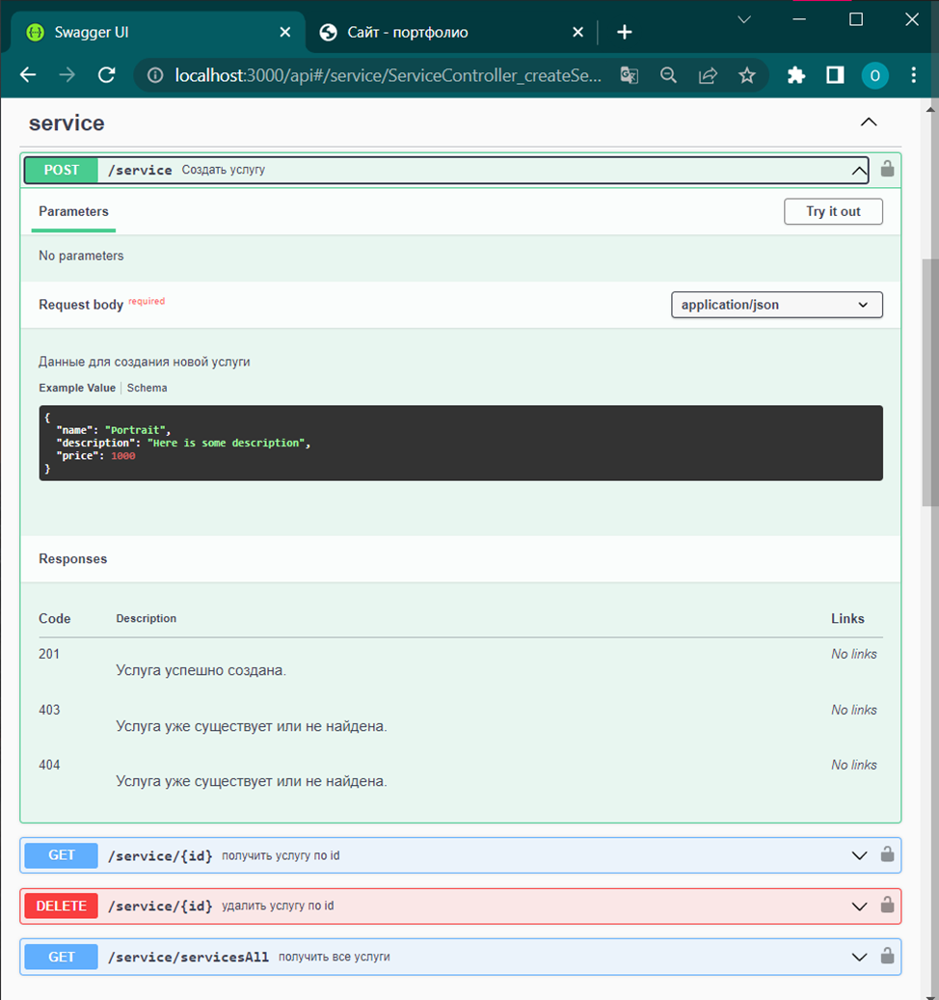

Разрабатываемое веб-приложение, это система по бронированию фото-услуг. Благодаря таким системам пользователям можно добавлять услуги в корзину и бронировать услуги, а администраторам отслеживать количество забронированных услуг внутри сайта и добавлять новые.
При работе с классическими системами по бронированию услуг можно выделить такие типовые задачи как просмотр услуг, добавление услуг в корзину, или удаление услуг из корзины, бронирование услуг из корзины или удаление текущих бронирований, администрирование бронирований пользователей.

Модуль работы с пользователями должен иметь:
- Возможность создать пользователя
- Возможность авторизовать пользователя

Модуль работы с услугами должен иметь:
- Возможность создать услугу, являясь администратором
- Удаление услуги, являясь администратором
- Отображение всех существующих услуг

Модуль работы с корзиной должен иметь:
- Возможность создать добавление услуги в корзину
- Удаление добавленного элемента из корзины
- Отображение всех существующих элементов в корзине для конкретного пользователя

Модуль работы с бронированиями должен иметь:
- Возможность создать бронирование
- Удаление записи о бронировании
- Отображение всех существующих бронирований конкретного пользователя
- Отображение полного списка бронирований

Модуль работы с отзывами должен иметь:
- Возможность создать отзыв
- Отображение всех существующих отзывов

Скриншот страницы для регистрации пользователя, где есть форма для регистрации, в которой надо ввести имя пользователя и пароль, и затем нажать кнопку «Зарегистрироваться», чтобы в базе данных создалась запись о новом пользователе:

Скриншот страницы для логина пользователя с формой для входа, где можно ввести имя пользователя, пароль, и затем нажать кнопку «Войти»:

Скриншот страницы администрирования, которая доступна, если вошел пользователь с ролью «Администратор». На этой веб-странице можно создать в базе данных запись о новой услуге в разделе «Добавить новую услугу». В разделе «Удалить услугу» можно выбрать название услуги из выпадающего списка и удалить, нажав кнопку:

Скриншот веб-страницы, где отображаются все существующие отзывы пользователей к услугам:

На рисунке ниже изображена веб-страница, где отображается полный список всех существующих услуг, под каждой из которых есть кнопка «Добавить в корзину», чтобы вошедший с ролью «Пользователь» мог добавить соответствующую услугу в корзину. Справа от каждой услуги есть форма для отправки отзыва о соответствующей услуге:

На рисунке ниже изображена веб-страница с корзиной пользователя. Здесь отображается полный список услуг, которые добавил в свою корзину вошедший пользователь. В третьем столбце есть поле для ввода даты, в четвертом столбце есть кнопка «Забронировать», чтобы пользователь мог забронировать добавленную в корзину услугу на определенную дату. В нижней части страницы отображается полный список элементов, добавленных в корзину, всеми пользователями:

На скриншоте изображена веб-страница с бронированиями вошедшего пользователя. В правой части карточки каждого бронирования есть кнопка «Отменить» для удаления записи об этом бронировании из базы данных:

Роль «гость» внутри приложения – тип пользователя, который может зарегистрироваться, может просматривать доступные веб-страницы, но не может добавить услугу в корзину, забронировать услугу или оставить отзыв.

Роль «пользователь» внутри приложения – тип пользователя, который может войти на сайт, чтобы пользоваться страницей «Корзина» и «Мои бронирования», чтобы управлять элементами корзины и бронированиями, может написать отзыв.

Роль «администратор» внутри приложения – тип пользователя, который может войти на сайт, чтобы отслеживать бронирования пользователей и управлять доступными услугами.

[image]: public/assets/img/web_lab3.png

  
## Описание:

1. <strong>Users</strong> - содержит информацию о зарегистрированных пользователях сайта. Таблица будет иметь следующие поля:
   
- id - идентификатор пользователя
- username - имя пользователя
- password - пароль пользователя

2. <strong>Service</strong> - содержит информацию о услугах, предлагаемых фотографом. Таблица будет иметь следующие поля:
- id - идентификатор услуги
- name - название услуги
- description - описание услуги
- price - стоимость услуги

3. <strong>User_Service</strong> - таблица, связывающая зарегистрированных пользователей сайта с выбранными ими услугами, то есть это корзина пользователя - здесь находятся услуги которые выбрал пользователь и которые он хочет забронировать. После брони услуги и указания даты при бронировании появляется запись в таблице Bookings. Таблица будет иметь следующие поля:
- id - идентификатор записи
- user_id - идентификатор пользователя из таблицы Users
- service_id - идентификатор услуги из таблицы Services

4. <strong>Booking</strong> - таблица, содержащая информацию о бронировании услуг фотографа пользователями, то есть здесь содержатся услуги из корзины пользователя (User_Services ) которые он уже забронировал. Таблица будет иметь следующие поля:
- id - идентификатор бронирования
- user_id - идентификатор пользователя из таблицы Users
- service_id - идентификатор услуги из таблицы Services
- booking_date - дата бронирования услуги

5. <strong>Comment</strong> - таблица, содержащая комментарии пользователей к фото-услугам. Пользователь может оставить отзыв на услугу только если он забронировал услугу. 

- id - идентификатор комментария
- booking_id - идентификатор бронирования
- service_id - идентификатор услуги из таблицы Services
- user_id - идентификатор пользователя из таблицы Users
- comment_text - текст комментария
- created_at - дата и время создания комментария

## Связи:

    One-to-many:
    - Comments и Service
    - Comments и Booking

    Так как каждая услуга может иметь несколько комментариев,
    и каждое бронирование может иметь несколько комментарев,
    но комментарий только об одном Service и Booking

    Many-to-many:
    -User_Service и Service
    -Booking и Service

    Так как один пользователь может выбрать несколько услуг,
    и одна услуга может быть выбрана несколькими пользователями.
    Так как один пользователь может забронировать несколько услуг,
    и одна услуга может быть выбрана несколькими пользователями.

В качестве описания программного интерфейса был выбран инструмент, поддерживающий стандарт OAS 3.0 – Swagger. Далее представлена полученная документация API полученная автоматически по директивам, указанным в декораторах различных методов и структурах данных внутри разрабатываемой информационной системы.

Автор - [Овсянникова Ольга Андреевна](https://github.com/is-web-y24/honeySimulator)

